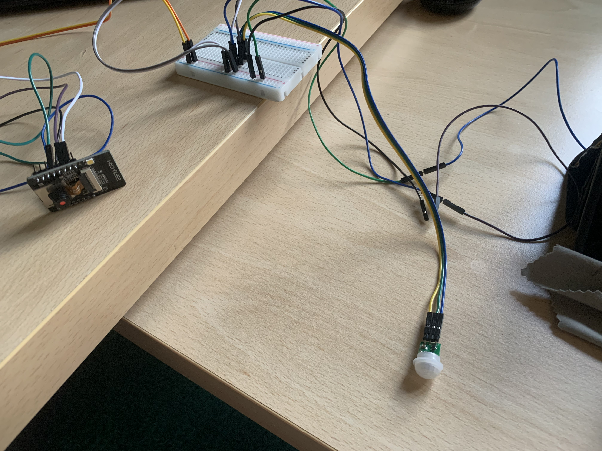
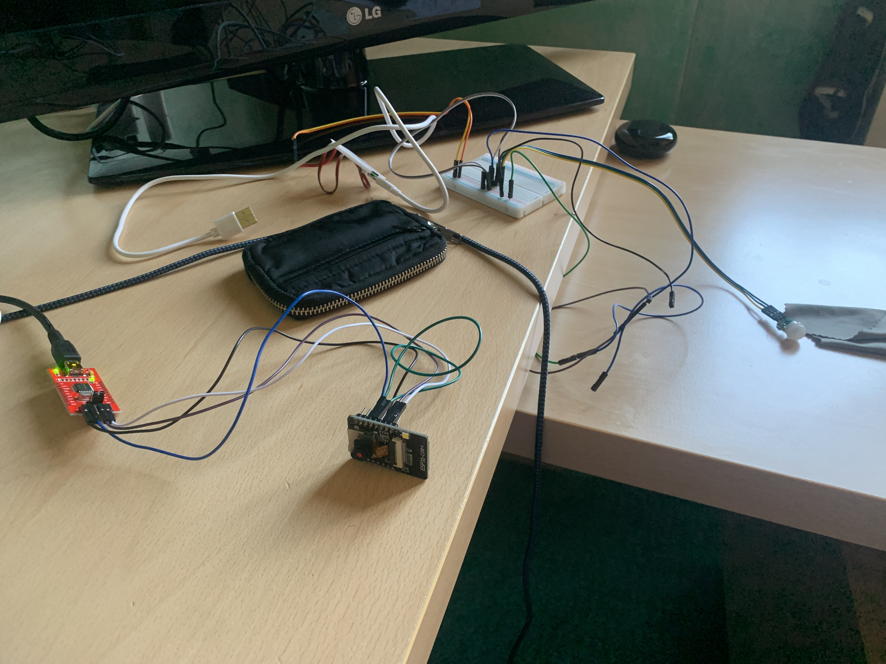
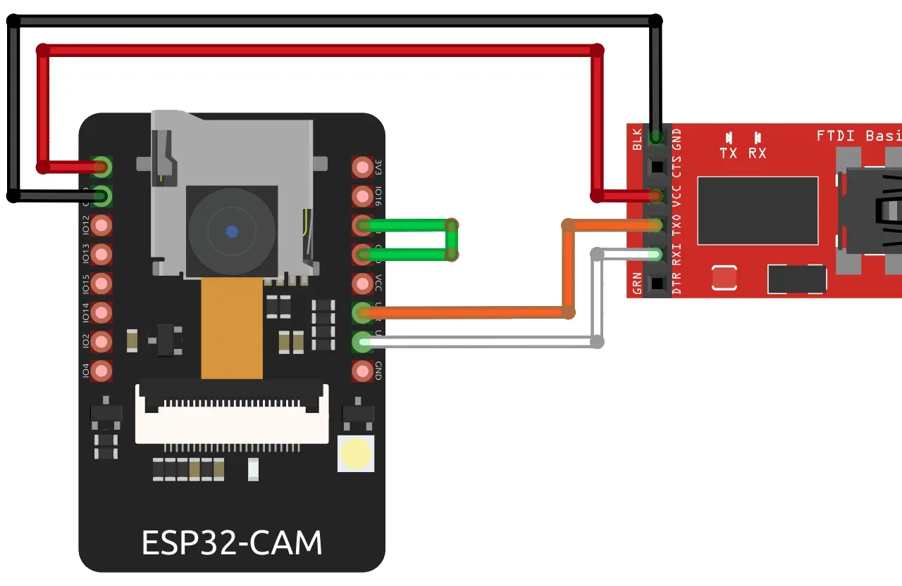
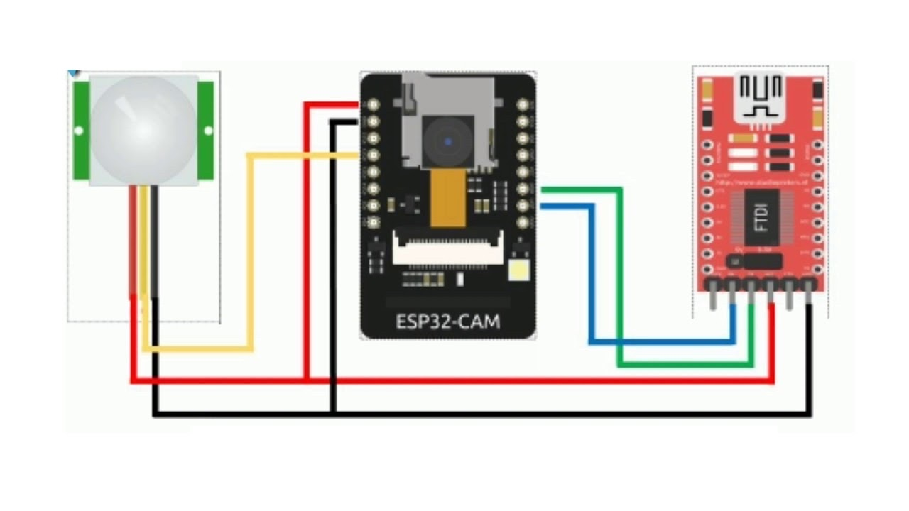

# Esp32-Cam-PIR-Telegram

Security-Camera with Esp32 Cam, PIR and Telegram Bot with a beautiful ReplyKeyboard.

## Introduction

This is a Telegram bot for the ESP32-CAM that allows you to control your board from anywhere to request a photo, sensor readings or control the flash. Additionally, you’ll receive a notification with a new photo whenever motion is detected.

## Components

- [ESP32 cam](https://it.aliexpress.com/item/1005001636562460.html?spm=a2g0o.productlist.0.0.16fc503d0wl8rc&algo_pvid=baa2e76c-a35f-4595-be60-1be9efe646fb&aem_p4p_detail=202109300738006397396223439360004721863&algo_exp_id=baa2e76c-a35f-4595-be60-1be9efe646fb-1&pdp_ext_f=%7B%22sku_id%22%3A%2212000016918444564%22%7D)
- [PIR Sensor](https://it.aliexpress.com/item/1005001621761807.html?spm=a2g0o.productlist.0.0.294fdb7fpNCz9S&algo_pvid=5555f235-4b5d-431b-86cc-56059e8efd2b&aem_p4p_detail=202109300738471165623116532760004724294&algo_exp_id=5555f235-4b5d-431b-86cc-56059e8efd2b-7&pdp_ext_f=%7B%22sku_id%22%3A%2212000016846606359%22%7D)
- [Cables](https://it.aliexpress.com/item/4000203371860.html?spm=a2g0o.productlist.0.0.1c8a5003XXXdRP&algo_pvid=a06c9c8c-c5de-44fb-b14f-4172b9e45c68&aem_p4p_detail=2021093007392310196238824126320004726334&algo_exp_id=a06c9c8c-c5de-44fb-b14f-4172b9e45c68-0&pdp_ext_f=%7B%22sku_id%22%3A%2210000000774493026%22%7D)
- [Eprom Programmer (FT232RL) ](https://it.aliexpress.com/item/32976151956.html?spm=a2g0o.productlist.0.0.2e271dfb8OSomB&algo_pvid=46d43297-c998-4b95-8a58-45d7570c0d51&algo_exp_id=46d43297-c998-4b95-8a58-45d7570c0d51-25&pdp_ext_f=%7B%22sku_id%22%3A%2266648807704%22%7D)

## Connection schema - For Programming in Arduino IDE

## Connection schema - For common use

## Available Telegram Commands

- 📷Photo📷: Capture a photo with/without flash based on "📷Flash ON💡" or "📷Flash OFF📵"
- 📷Flash ON💡: Enable flash foro photos
- 📷Flash OFF📵: Disable flash for photos
- 🚨Arm🔥: Enable motion detection
- 🚨Disarm📵: Disable motion detection
- 💡LedON🔥: Enable flash (can be used as a night light)
- 💡LedOFF📵: Diable flash
- 💡AutoFlash🤖: If enabled, the flash will be used for every photo in the time slot from 8pm to 6am.

## Still to be implemented:

- [ ] Beautiful keyboard with emoji
- [ ] Video recordings based on motion and Telegram command
- [ ] Save photo/video on micro-sd card
- [ ] SSH communication protocol to save photo in secondary network storage
